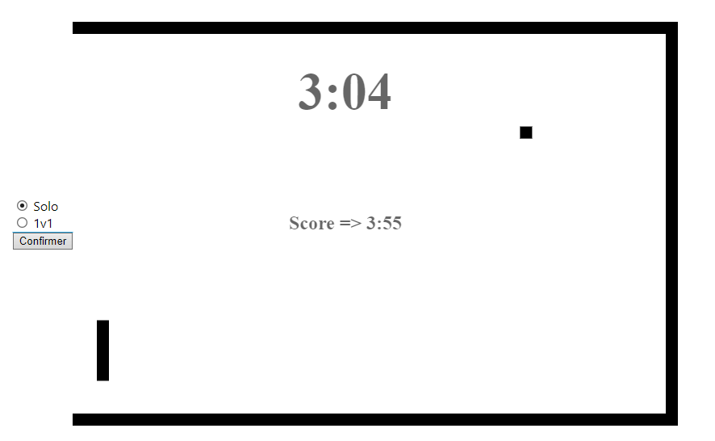
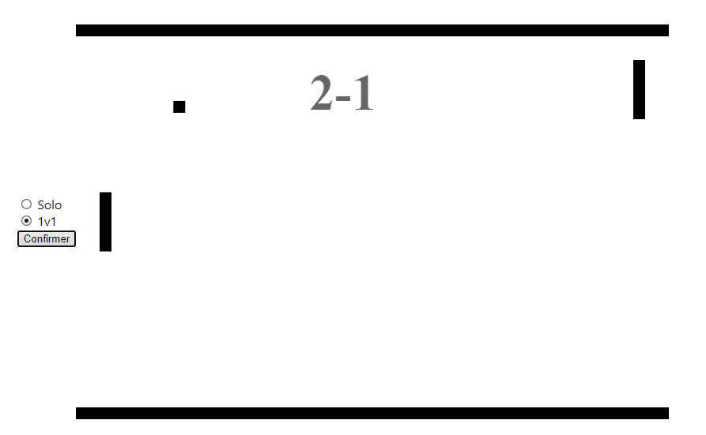

# Pong Solo and multi

Pong is the first game ever created.

I tried to recreate it in a web project.

---

Solo mode

* In solo, the goal is to stay alive the longest time possible.

* You are playing in a cage within the ball bounces, you have to kick it with your racket.

* the ball becomes faster and faster over the time.

* You move with the mouse and you have to press Enter to restart the game.

---

1v1 mode

* This is the classic game, the first to 7 goals win the game.

* The left player moves with Z and S. The right player with P and M.

* You have to press Enter to restart a game.

---

I let bugs and things that cool be improved for people who would want to try to fix and improve what you want.

---

It's my first project that I push on github, I hope you'll like the project !